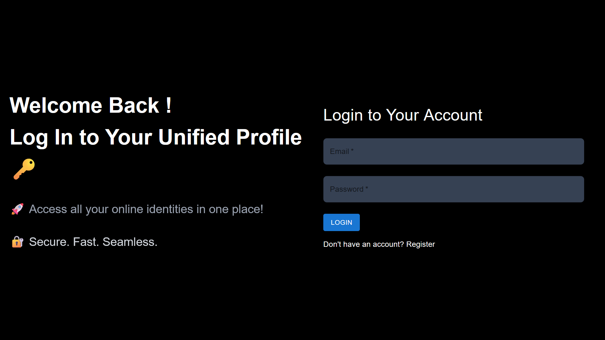
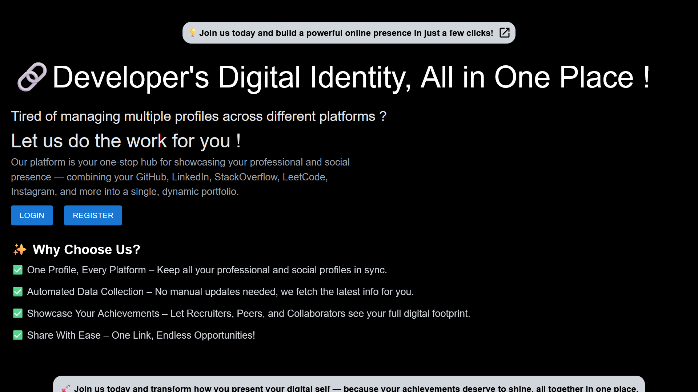
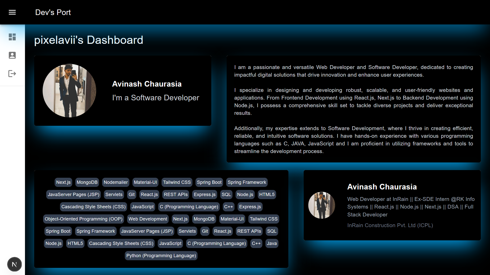

# 🚀 Dev's Port – Developer's Digital Identity

[Live Demo 🔗](https://www.devsport.vercel.app)

Dev's Port is a modern web application designed to unify a developer's digital identity into a single, dynamic portfolio. It eliminates the hassle of managing multiple profiles by automatically fetching and displaying data from platforms like **GitHub**, **LinkedIn**, **LeetCode**, **StackOverflow**, **Instagram**, and more.

With a sleek and responsive UI, Dev's Port empowers users to showcase their **Achievements**, **Skills**, and **Social Presence** in one centralized hub — making it easier for **Recruiters**, **Collaborators**, and **Peers** to discover their complete professional footprint.

---

## ✨ Features

- 🔗 One Profile, Every Platform – Keep all your professional and social profiles in sync.
- 🔄 Automated Data Collection – No manual updates needed, latest info is fetched automatically.
- 🏆 Showcase Your Achievements – Display your full digital footprint.
- 📤 Easy Sharing – One link to rule them all!

---

## 🛠 Tech Stack

- **Frontend:** Next.js, React, Tailwind CSS, MaterialUI
- **State Management:** React Context API
- **Authentication:** JWT Auth
- **Database:** MongoDB
- **Deployment:** Vercel

---

## 📸 Screenshots

### 🔐 Login Page


### 🏠 Home Page


### 👤 User Profile



## 🚀 Getting Started

1. Clone the repository:
   ```bash
   git clone https://github.com/pixelavii/devs-port.git


Made with ❤️ by Avinash